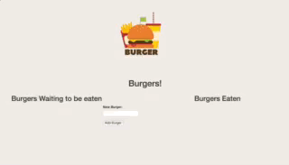

# Burgers!

Web application allowing a user to create any burger adding the burger to the "Burgers waiting to be eaten" column. "Burgers Waiting to be Eaten" can be devoured once the "devour" button is clicked. Burger is then moved to the "Burgers Eaten" column.

### Technologies Used:
HTML5/CSS3, JavaScript, Node.js, MySQL, sequelize, express, npm packages,

#### Walkthroughs:
#### General:
1. Type a burger name into the input field.
2. Click button to add a burger. Repeat as many times as you want.
3. Once you're ready, click the "devour" button next to any of the newly created burgers and the burger will be devoured.

